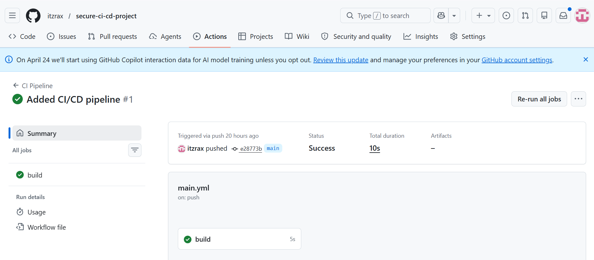
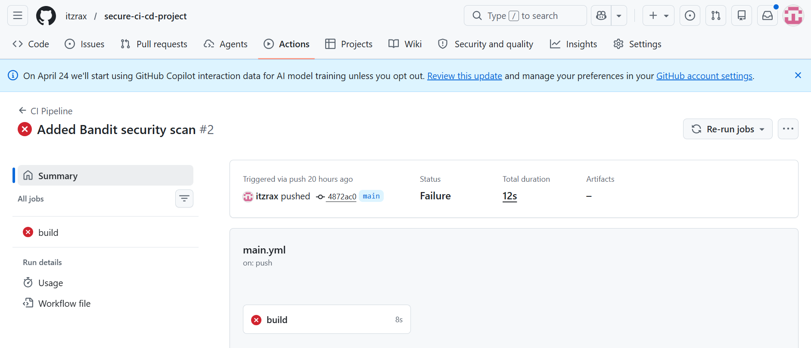
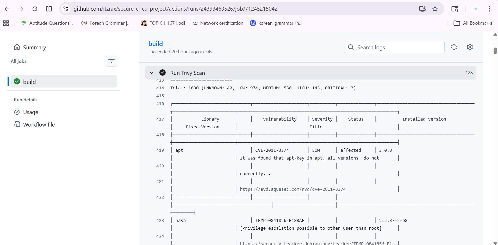

# Secure CI/CD Pipeline | DevSecOps

A Python Flask application with an automated security pipeline using
GitHub Actions, Bandit, Docker, and Trivy.

This project demonstrates how security scanning can be integrated
into a CI workflow to identify potential issues before deployment.

## Architecture

```text
Code Push
    |
    v
GitHub Actions
    |
    +--> Install Python Dependencies
    |
    +--> Bandit: Python Security Analysis
    |
    +--> Docker: Build Application Image
    |
    +--> Trivy: Scan Image for Vulnerabilities
```

## Tech Stack

- Python 3.10
- Flask
- Docker
- GitHub Actions
- Bandit — Python security analysis
- Trivy — container image vulnerability scanning

## Pipeline Workflow

The workflow in `.github/workflows/main.yml` runs on code pushes.

1. Checks out the repository.
2. Sets up Python and installs dependencies.
3. Runs Bandit against the repository.
4. Builds the Docker image.
5. Scans the built image using Trivy.

## Screenshots

### Successful Pipeline


### Failed Pipeline


### Trivy Vulnerability Scan


## Run Locally

### Prerequisites
- Python 3.10 or compatible
- Docker

### Run with Python

```bash
pip install -r requirements.txt
python app.py
```

Open http://localhost:5000 in your browser.

### Run with Docker

Build the image:

```bash
docker build -t secure-app .
```

Start the container:

```bash
docker run --rm -p 5000:5000 secure-app
```

Open http://localhost:5000 in your browser.

## Current Scope

This project focuses on automated security analysis and container
image scanning within CI. It does not currently implement application
deployment or automated application tests.

The Flask dashboard is a demonstration application, not a production
security monitoring system. Additional hardening is required before
production use.

## Future Improvements

- Add automated application tests.
- Pin dependencies and use a smaller, hardened base image.
- Disable Flask debug mode for deployment.
- Improve container security and vulnerability reporting.
- Add deployment automation after the security checks.

## Learning Outcomes

- Integrating security tools into a CI workflow.
- Performing static analysis on Python code.
- Building and scanning Docker images.
- Using GitHub Actions to automate development checks.
